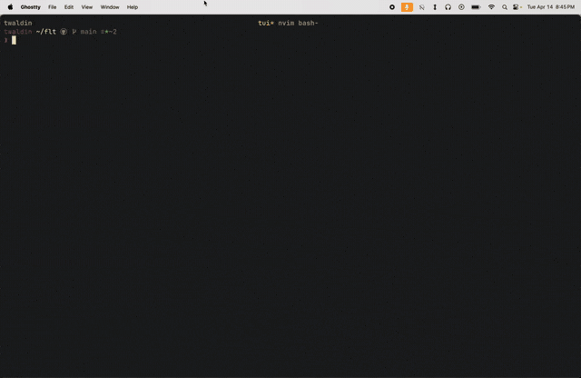

# flt

You build an agent in Claude Code. It's good. Then you need one in Codex for the fast stuff, one in Gemini for the cheap stuff. Now you have three tools that don't know about each other, three different instruction formats, three ways to check status. You're locked into whichever ecosystem you started with, or you're managing three separate workflows.

flt makes every AI coding CLI feel like the same tool. `flt spawn`, `flt send`, `flt kill` — works the same whether the agent runs in Claude Code, Codex, Gemini CLI, Aider, OpenCode, or SWE-agent. Agents message each other across CLIs. A Claude Code orchestrator can spawn a Codex coder and a Gemini researcher, and they all report back through the same inbox.



## Install

```bash
bun install -g @twaldin/flt-cli
```

Requires [Bun](https://bun.sh) and [tmux](https://github.com/tmux/tmux). You need at least one AI coding CLI installed (`claude`, `codex`, `gemini`, `aider`, `opencode`, or SWE-agent). `git` is required for worktree-based agent isolation.

## Quick start

```bash
flt init                    # initialize fleet + start controller
flt tui                     # open the terminal UI

# spawn agents in any CLI from the same interface
flt spawn coder -c claude-code -m sonnet -d ~/project "fix the login bug"
flt spawn fast -c codex -m gpt-5.3-codex -d ~/project "add input validation"
flt spawn researcher -c gemini -m gemini-2.5-flash -d ~/project "find similar auth patterns"

# talk to them
flt send coder "also add tests for the edge case"

# they talk to each other
# (from inside the researcher agent)
flt send coder "found 3 patterns in the codebase, see PR #12 for details"

# watch, kill
flt logs coder
flt kill fast
```

Save presets so you stop typing flags. The name is the preset — if a preset matches the agent name, it resolves automatically:

```bash
flt presets add coder -c codex -m gpt-5.3-codex
flt spawn coder -d ~/project "fix the parser bug"   # name == preset, auto-resolved
```

Presets can store everything — `cli`, `model`, `dir`, `parent`, `worktree`, `persistent`, `soul`. A fully configured preset means spawn is just name + task:

```bash
*/30 * * * * flt spawn monitor "run health checks"   # dir, parent, cli, model all in preset
```

`-p` is only needed when the name differs from the preset: `flt spawn monitor2 -p monitor`.

## The TUI

The real-time terminal UI is built from scratch — raw ANSI screen buffer with double-buffered damage tracking, not a framework. It renders the full fleet in a sidebar with live status indicators, lets you read agent output, type to agents directly, and manage everything without leaving the terminal.

```
:theme dracula              # 15 built-in themes
:theme tokyo-night
:ascii cairn                # custom sidebar logo (figlet)
:spawn coder -p coder "fix it"
:send coder "add tests too"
:kill coder
```

Keybinds are vim-style and fully configurable via `~/.flt/keybinds.json`. Sidebar shows agent hierarchy (who spawned whom), live status (running/idle/exited), and inbox notifications. The main pane streams the selected agent's terminal output. Insert mode forwards keystrokes directly to the agent.

DEC 2026 synchronized output for zero-flicker rendering on modern terminals (Ghostty, WezTerm, iTerm2).

| Mode | Key | Action |
|------|-----|--------|
| Normal | `j/k` | Select agent |
| Normal | `Enter` | Focus log pane |
| Normal | `i` | Insert mode (type to agent) |
| Normal | `s` | Spawn |
| Normal | `r` | Reply to selected agent |
| Normal | `m` | Inbox |
| Normal | `t` | Shell |
| Normal | `K` | Kill agent |
| Normal | `q` | Quit |
| Log focus | `j/k` | Scroll |
| Log focus | `G/g` | Jump to bottom/top |
| Log focus | `/` | Search |
| Insert | `Esc` | Back to previous mode |
| Inbox | `j/k` | Navigate, `d` delete, `r` reply |

## Why not just use one CLI?

Every AI coding CLI is good at working alone. The problem is they're all good at different things:

- **Claude Code** — best at complex multi-file refactors, deep codebase understanding
- **Codex** — fastest for straightforward fixes, cheapest for bulk work
- **Gemini CLI** — huge context window, good for research and large file analysis
- **Aider** — best git integration, works with any model via OpenRouter

Without flt, picking one means giving up the others. With flt, you use the right tool for each task and they all coordinate through the same messaging system.

## Adapters

Each adapter handles the messy per-CLI differences so you don't have to:

| CLI | Adapter | What it handles |
|-----|---------|-----------------|
| Claude Code | `claude-code` | Permission bypass, trust dialogs, spinner detection |
| Codex | `codex` | Sandbox bypass, slow startup (~60s), "esc to interrupt" detection |
| Gemini CLI | `gemini` | Tool execution prompts, braille spinner detection |
| Aider | `aider` | `--yes` flag, OpenRouter model routing |
| OpenCode | `opencode` | Agent file injection, full-pane ready detection |
| SWE-agent | `swe-agent` | Prompt template injection, no instruction file |

Dialog auto-approval means agents spawned from cron never block on permission prompts. This is what makes unattended operation work.

## Agent identity

Agents get their identity from two sources:

**SOUL.md** — who the agent is. Lives at `~/.flt/agents/<name>/SOUL.md` or referenced via preset. Defines role, behavior, domain knowledge. Injected into the CLI's native instruction file on spawn.

**Skills** — what the agent can do. Markdown files in `~/.flt/skills/` (global) or `~/.flt/agents/<name>/skills/` (per-agent). For Claude Code, skills become slash commands. For other CLIs, skills are embedded in the instruction file.

The project's own instructions (CLAUDE.md, AGENTS.md, GEMINI.md) stay untouched — flt prepends its block with markers and removes it on kill.

## The fleet pattern

flt gets interesting when agents manage other agents. A monitor finds a bug, spawns a coder, the coder makes a PR, a reviewer checks it, and you get a message:

```
[MONITOR]: PR #45 ready for merge — fixed KNN pricing regression
```

The monitor, coder, and reviewer can each be different CLIs and models. The orchestrator picks the right tool for each job.

```bash
# cron spawns the monitor every 30 minutes
*/30 * * * * flt spawn monitor "run health checks"

# monitor's SOUL.md tells it to spawn coders when it finds bugs
# the coder's preset uses codex for speed
# the reviewer's preset uses gpt-5.4 for thoroughness
```

Messaging is simple: `flt send parent` routes to whoever spawned you. `flt send <name>` goes to any agent. Messages land in the inbox or the parent agent's tmux session, depending on who the parent is.

## Workflows

YAML state machines that chain agents together:

```yaml
# ~/.flt/workflows/code-review.yaml
name: code-review
steps:
  - id: implement
    preset: coder
    task: "Implement {task}"
    on_complete: review

  - id: review
    preset: reviewer
    task: "Review PR {pr}. Branch: {steps.implement.branch}"
    on_complete: done
    on_fail: implement
    max_retries: 2
```

```bash
flt workflow run code-review -t "add OAuth login"
flt workflow status code-review
```

Later steps can reference earlier agents' worktrees, branches, and PRs via template variables. Agents signal transitions with `flt workflow pass` or `flt workflow fail`.

## Architecture

```
~/.flt/
  state.json           # fleet state (single writer: controller)
  controller.sock      # Unix socket for CLI → controller RPC
  presets.json         # spawn presets (cli, model, dir, parent, worktree, persistent, soul)
  config.json          # settings, theme
  inbox.log            # agent messages
  activity.log         # JSONL event stream
  workflows/           # YAML definitions + run state
  skills/              # global skills
  agents/<name>/
    SOUL.md            # identity
    state.md           # agent state (compaction/resume)
    skills/            # per-agent skills
```

```
┌──────────┐     ┌────────────┐     ┌─────────────┐
│ flt CLI  │────▶│ Controller │────▶│ tmux agents │
│ flt TUI  │     │ (daemon)   │     │ claude-code │
│ cron     │     │            │     │ codex       │
└──────────┘     │ state.json │     │ gemini      │
   Unix socket   │ polling    │     └─────────────┘
                 │ workflows  │
                 └────────────┘
```

The controller is the single writer to state. The TUI is a pure reader — close and reopen it without affecting running agents. State is flat JSON files that agents can read directly.

## CLI reference

```
flt init [-o name]                      # initialize fleet, start controller, open TUI
flt tui                                 # attach to TUI (lightweight reconnect)
flt spawn <name> [options] [bootstrap]  # spawn an agent
flt send <target> <message>             # message an agent or parent
flt kill <name>                         # kill an agent
flt list                                # list agents with status
flt logs <name> [-n lines]              # view agent output
flt tail                                # tail inbox
flt activity                            # fleet event log
flt exit                                # shut down fleet
flt presets list|add|remove             # manage presets
flt workflow run|status|list|cancel     # manage workflows
flt skills list                         # list available skills
flt controller start|stop|status        # manage controller daemon
```

### Spawn flags

| Flag | Short | Description |
|------|-------|-------------|
| `--cli <cli>` | `-c` | CLI adapter |
| `--model <model>` | `-m` | Model |
| `--preset <name>` | `-p` | Use a preset (auto-detected if name matches) |
| `--dir <path>` | `-d` | Working directory |
| `--no-worktree` | `-W` | Skip git worktree creation |
| `--parent <name>` | | Override parent for messaging |
| `--persistent` | | Agent expected to respawn (shows different icon when dead) |

## Related

- [`harness`](https://github.com/twaldin/harness) — sister project: unified Python interface for invoking AI coding-agent CLIs as one-shot subprocesses. flt and harness solve adjacent problems (interactive sessions vs one-shot calls) and share knowledge about per-CLI args / env / output parsing. Uses `@twaldin/harness-ts` for CLI command construction metadata; flt adds tmux lifecycle on top. flt may eventually shell out to `harness run --json` for one-shot operations like `quickTestAdapter`. See [harness/examples/flt-spawn](https://github.com/twaldin/harness/tree/main/examples/flt-spawn) for the design notes.
- [`hone`](https://github.com/twaldin/hone) — prompt optimization tool. Useful inside flt agents when you need a mutator backend.
- [`agentelo`](https://github.com/twaldin/agentelo) — benchmark for AI coding agents on real GitHub bugs. Many flt presets correspond to high-ranked agentelo entries.

## License

MIT
